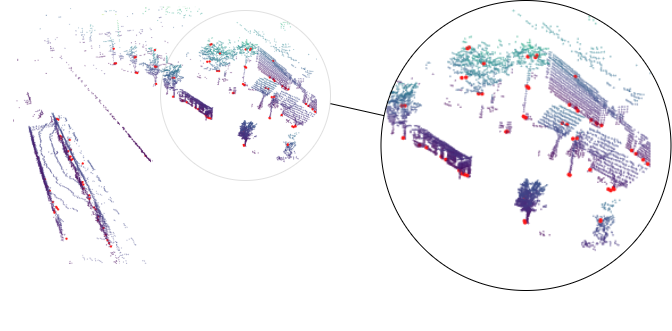
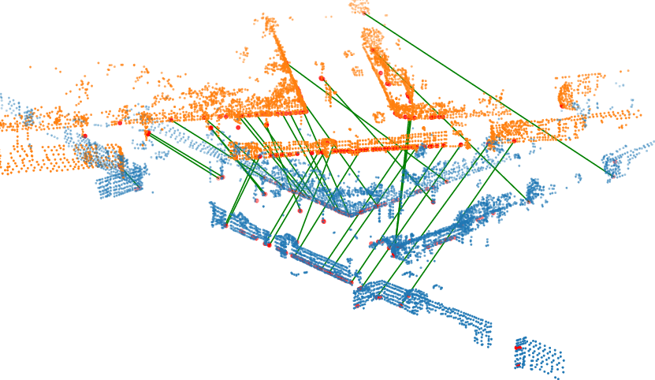
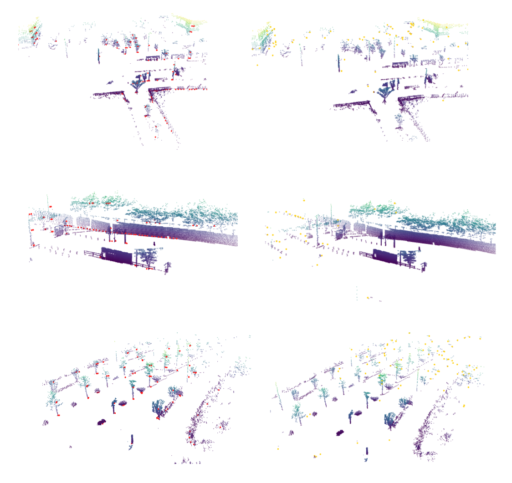

# EgonNN: Egocentric Neural Network for Point Cloud Based 6DoF Relocalization at the City Scale

Paper: [EgoNN: Egocentric Neural Network for Point Cloud Based 6DoF Relocalization at the City Scale](http://arxiv.org/xxxxxxx) 
submitted to IEEE Robotics and Automation Letters (RA-L)

[Jacek Komorowski](mailto:jacek.komorowski@pw.edu.pl), Monika Wysoczanska, Tomasz Trzcinski

Warsaw University of Technology

### What's new ###
* [2021-10-24] Evaluation code and pretrained models released.

### Our other projects ###
* MinkLoc3D: Point Cloud Based Large-Scale Place Recognition (WACV 2021): [MinkLoc3D](https://github.com/jac99/MinkLoc3D) 
* MinkLoc++: Lidar and Monocular Image Fusion for Place Recognition (IJCNN 2021): [MinkLoc++](https://github.com/jac99/MinkLocMultimodal)
* Large-Scale Topological Radar Localization Using Learned Descriptors (ICONIP 2021): [RadarLoc](https://github.com/jac99/RadarLoc)

### Introduction
The paper presents a **deep neural network-based method for global and local descriptors extraction from a point
cloud acquired by a rotating 3D LiDAR sensor**. The descriptors can be used for two-stage 6DoF relocalization. First, a course
position is retrieved by finding candidates with the closest global descriptor in the database of geo-tagged point clouds. Then,
6DoF pose between a query point cloud and a database point cloud is estimated by matching local descriptors and using a
robust estimator such as RANSAC. Our method has a simple, fully convolutional architecture and uses a sparse voxelized
representation of the input point cloud. It can **efficiently extract a global descriptor and a set of keypoints with 
their local descriptors from large point clouds with tens of thousand points**.




## Site is under construction. Training/evaluation code and pre-trained models will be released after the paper acceptance.


### Citation
If you find this work useful, please consider citing:


### Environment and Dependencies
Code was tested using Python 3.8 with PyTorch 1.9.1 and MinkowskiEngine 0.5.4 on Ubuntu 20.04 with CUDA 10.2.
Note: CUDA 11.1 is not recommended as there are some issues with MinkowskiEngine 0.5.4 on CUDA 11.1. 

The following Python packages are required:
* PyTorch (version 1.9.1)
* MinkowskiEngine (version 0.5.4)
* pytorch_metric_learning (version 0.9.99 or above)
* wandb

Modify the `PYTHONPATH` environment variable to include absolute path to the project root folder: 
```export PYTHONPATH
export PYTHONPATH=$PYTHONPATH:/home/.../Egonn
```

### Datasets

**EgoNN** is trained and evaluated using the following datasets:
* MulRan dataset: Sejong traversal is used. The traversal is split into training and evaluation part [link](https://sites.google.com/view/mulran-pr)
* Apollo-SouthBay dataset: SunnyvaleBigLoop trajectory is used for evaluation, other 5 trajectories (BaylandsToSeafood, 
ColumbiaPark, Highway237, MathildaAVE, SanJoseDowntown) are used for training [link](https://apollo.auto/southbay.html)
* Kitti dataset: Sequence 00 is used for evaluation [link](http://www.cvlibs.net/datasets/kitti/)

First, you need to download datasets using:

* For MulRan dataset you need to download ground truth data (*.csv) and LiDAR point clouds (Ouster.zip) for traversals: 
* Sejong01 and Sejong02. 
Use this [link](https://sites.google.com/view/mulran-pr/download).
* Download Apollo-SouthBay dataset using the download link on the dataset website [link](https://apollo.auto/southbay.html)
* Download Kitti odometry dataset (calibration files, ground truth poses, velodyne laser data) [link](http://www.cvlibs.net/datasets/kitti/eval_odometry.php)

After loading datasets you need to:
1. **Generate training pickles** needed for the network training. 
2. **Generate evaluation pickles** for model evaluation. 

### Training
First, download datasets and generate training and evaluation pickles as described above.
Edit the configuration file (`config_egonn.txt`). 
Set `dataset_folder` parameter to point to the dataset root folder.
Modify `batch_size_limit` parameter depending on available GPU memory. 
Default limit (=64) in `config_egonn.txt` for LiDAR-based model requires at least 11GB of GPU RAM.

To train the network, run:

```
cd training

python train.py --config ../config/config_egonn.txt --model_config ../models/egonn.txt 
```

### Pre-trained Model

EgoNN model trained (on training splits of MulRan and Apollo-SouthBay datasets) is available in `weights/egonn.pth`.

### Evaluation

To evaluate a pretrained model run the following command:

```
cd eval

python evaluate.py --dataset_root <dataset_root_path> --dataset <mulran|robotcar> --eval_set <evaluation_set_filename> --model_config ../config/egonn.txt --weights ../weights/egonn.pth

```

## Results

**EgoNN** performance...

## Visualizations
Below you can find visualizations of our keypoint detector results. On the left we show 128 keypoints with the highest saliency uncertainty, whereas on the right 128 with the lowest.




### License
Our code is released under the MIT License (see LICENSE file for details).


